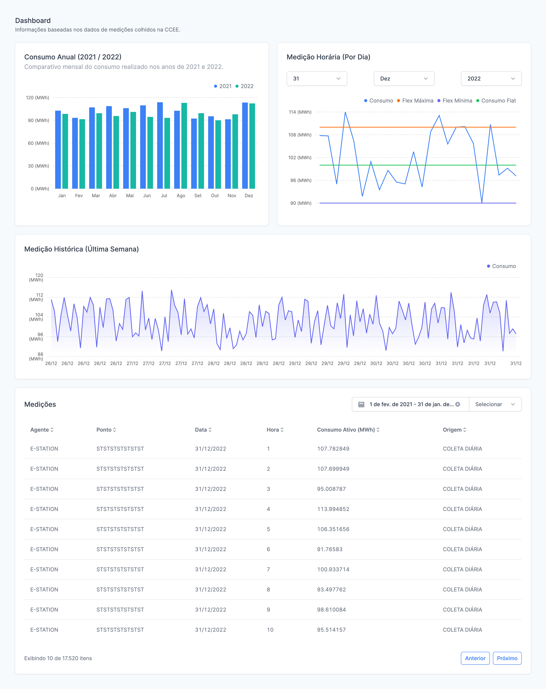

# 🚀 Front-end Challenge

Bem-vindo(a)!

Este é o desafio Front-end!

O objetivo deste desafio é avaliar suas habilidades de programação.

Quando sua solução estiver pronta, basta responder ao e-mail que recebeu com o link do seu repositório aqui no Github.

Em seguida, enviaremos o feedback e as instruções dos próximos passos.

Caso tenha alguma dúvida, estamos disponíveis no e-mail *marcos@e-station.io*

Bom desafio!

> ⚠️ **É importante que o seu repositório esteja público; caso contrário, não conseguiremos avaliar sua resposta.**

# 🧠 Contexto

O desafio consiste em implementar um dashboard com dados de medição de energia elétrica que deverá possuir as seguintes funcionalidades:

- [ ] Uma visão comparativa do consumo mês a mês entre os anos de 2021 e 2022.
- [ ] Uma visão que exiba apenas as medições hora a hora com base no dia, mês e ano selecionados.
- [ ] Uma visão com as medições horárias da última semana.
- [ ] Uma tabela contendo a relação de medições, permitindo:
  - [ ] Filtrar medições por período.
  - [ ] Paginação dos resultados retornados.
  - [ ] Ordenação pelos campos: Agente, Ponto, Data, Hora, Consumo Ativo (MWh) e Origem.



### Visão: Consumo Anual

Os dados devem ser exibidos considerando o consumo total de um determinado mês, comparando-o ao mesmo mês do ano anterior.

▶️ Lembre-se de que os dados disponíveis para o desafio estão fragmentados por hora. Portanto, será necessário consolidá-los para realizar essa comparação, somando todo o consumo apurado em cada um dos meses.

### Visão: Medição Horária (Por Dia)

Em nosso dashboard, o gestor pode selecionar um dia, mês e ano específicos para avaliar as medições coletadas hora a hora, com o intuito de verificar se estão de acordo com o esperado.

Para esse desafio, é importante considerar que o volume contratado foi exatamente de **100 MWh**, com uma flexibilidade de 10%. Isso significa que o consumo deve variar de 90 a 110 MWh, sendo 100 MWh o consumo flat, sem ultrapassar os limites contratados.

### Visão: Medição Histórica (Última Semana)

Assim como na visão anterior, você deverá exibir os valores por hora. No entanto, para essa perspectiva, desconsidere a flexibilidade e apresente apenas os dados dos últimos 7 dias disponíveis no arquivo.

### Visão: Medições

Para essa visão, você deve criar uma tabela simples que apresente as medições.

A tabela deve possibilitar: ordenação, filtragem (por período) e paginação. Existem mais de 17 mil registros; atente-se às questões de desempenho.

## 📋 Instruções ReactJS

Chegou a hora de colocar a mão na massa!

- Siga [esse protótipo](./images/dashboard.png) como referência para o que irá construir.
- Utilize Next.js e Typescript.
- Faça a estilização com Tailwind.
- Utilize uma biblioteca de gráficos da sua escolha.
- Por favor, inclua no README as instruções de instalação do projeto.
- Sinta-se à vontade para incluir quaisquer observações.
- Para cada uma das 4 visões do dashboard, considere que será utilizada uma API específica. Por isso, em cada uma delas, adicione um estado de *loading* usando Skeleton e um estado de erro para aprimorar a experiência do usuário.

## Dados de API

Os dados necessários para compor o dashboard encontram-se em um arquivo `.json` no repositório do desafio.

Mantenha o foco na construção da interface e em seus respectivos comportamentos. Este é um desafio de Front-end, portanto, sinta-se à vontade para usar bibliotecas como [JSON Server](https://www.npmjs.com/package/json-server) para expor uma API fake com base no JSON disponível.

No arquivo, você encontrará medições (hora a hora) dos anos 2021 e 2022. Este é um exemplo:

```json
{
    "id": "6ca9116e-1751-4b8f-b716-a3f12632d13a",
    "reference": "31/12/2022",
    "year": 2022,
    "month": 12,
    "day": 31,
    "hour": 1,
    "consumption": 107.782849,
    "agent": "E-STATION",
    "meter": "STSTSTSTSTSTST",
    "origin": "COLETA DIÁRIA",
    "intervalInMinutes": 60,
    "isEstimated": false
}
```

## ✔️ Critérios de Avaliação

Além dos requisitos mencionados acima, iremos avaliar os seguintes critérios durante a correção do desafio:

- Gerenciamento de estado
- Componentização
- Responsividade
- Preocupação com usabilidade
- Preocupação com acessibilidade
- Testes de Unidade e E2E
- Padrões de código
- Padrão de commits (_Conventional_)
- Outros...

## 😎 Seria legal
- Realizar o deploy na Vercel ou em outro local de sua preferência e disponibilizar um link de visualização.
- Utilizar o cache do Next.js.
